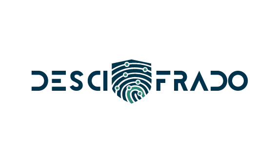

# Descifrado
Descifrado derived from Descifrador is the spanish term for "decoder". This repository will be responsible for decoding an encrypted data and displaying it.

Here the encrypted data is expected in the form of either a QR code or a Barcode. 

Example: on scanning a barcode or a qr code, the details of the items in the dataset should be accessed and displayed.
